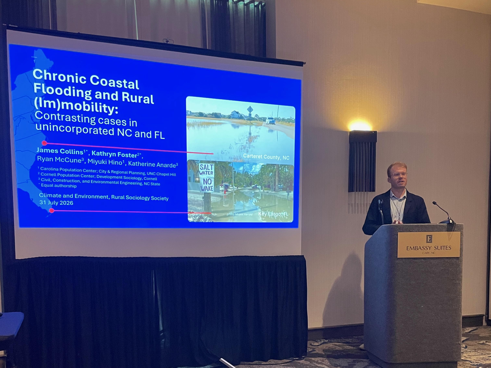

I presented on an ongoing collaboration with Kathryn Foster (Cornell Population Center, Cornell Sociology) during the Climate and Environment session of the Rural Sociological Society annual meeting in Cary, NC.

Kathryn and I are comparing cases in rural North Carolina and Florida communities facing sea-level rise. We ask, how do rural residents think about staying or moving away as flooding becomes more frequent? Our preliminary analysis and results highlight the role of county government messaging and adaptation planning in shaping expectations about future adaptation and (im)mobility aspirations.

I presented our work presented alongside other emerging climate (im)mobilities research along Alaskan shorelines by Ayşe Akyıldız (Penn State). Thanks to Dr. Ryan Thomson (Auburn) for excellent facilitation.
