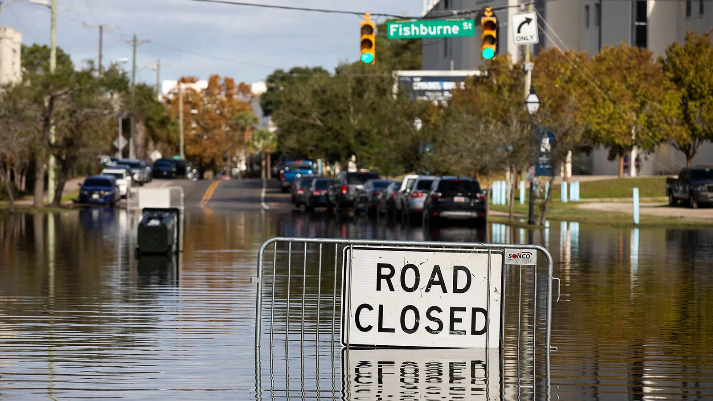

::: {.callout-note appearance="simple"}

## Republished story

Dr. Hino spoke with Yale Climate Connections about how her research uncovers the frequency of chronic coastal flooding impacts. The story is republished below.

:::

<h1>Some coastal towns in North Carolina now flood up to 100 days a year</h1>

by YCC Team, Yale Climate Connections  September 14, 2026

<figure class="wp-block-audio"><audio controls="" src="https://traffic.libsyn.com/secure/climateconnections/CX260914.mp3"></audio></figure>

Transcript:

In Beaufort, Carolina Beach, and other coastal towns in North Carolina, residents increasingly face flooding – even without rain in sight.

Hino: “Our tides and our normal changes in ocean water levels are now happening on top of higher average sea levels. … And that water level is too much for the infrastructure. And so you get roads that are inundated, stormwater drainage systems that don't function anymore.”

<a href="https://planning.unc.edu/faculty/hino/ ">Miyuki Hino</a> of the University of North Carolina at Chapel Hill says flooded roads force people to miss work and school.

Hino: “People skip their doctor's appointments and other types of critical errands because the roads are cut off. This might not seem like a big deal, but when this type of flooding is happening 50, 60, even 100 days a year in some of the places that we study, that really adds up.”

To track the problem, Hino’s team has been <a href="https://www.nature.com/articles/s43247-025-02326-w ">installing sensors</a> and cameras in strategic places and sharing the data in real time with residents.

Hino: “So that they can figure out if they can get home or if they need to reroute or wait out a couple hours and see if the floodwaters go down.”

Researchers are also using the data to model water pumps, seawalls, and other solutions that communities can implement to help residents stay safe long-term.

<em>Reporting credit: Myriam Vidal Valero / ChavoBart Digital Media</em>

This <a target="_blank" href="https://yaleclimateconnections.org/2026/09/some-coastal-towns-in-north-carolina-now-flood-up-to-100-days-a-year/">article</a> first appeared on <a target="_blank" href="https://yaleclimateconnections.org">Yale Climate Connections</a> and is republished here under a <a target="_blank" href="https://creativecommons.org/licenses/by-nc-nd/4.0/">Creative Commons Attribution-NonCommercial-NoDerivatives 4.0 International License</a>.

 