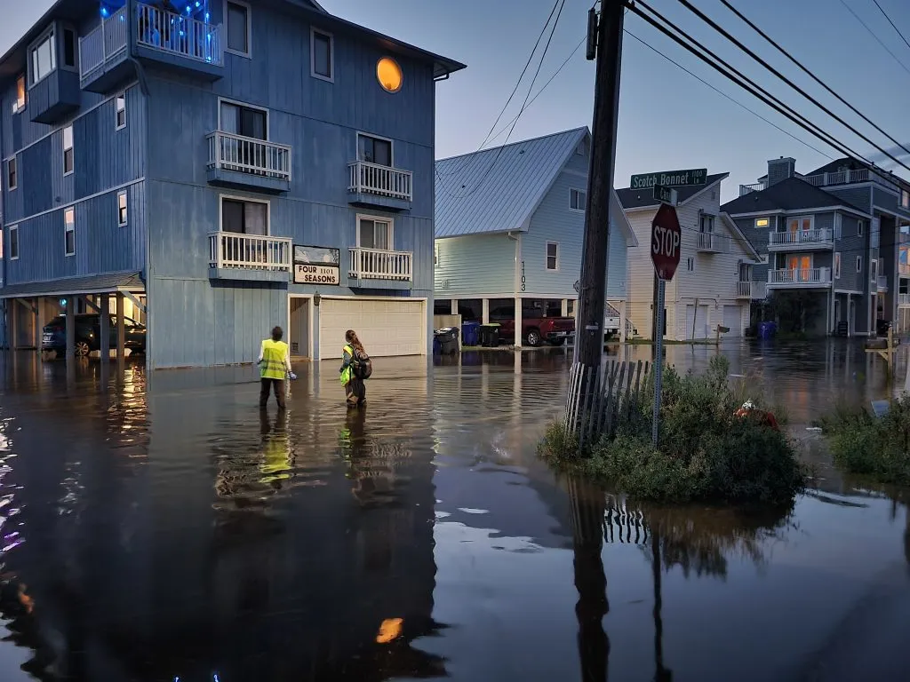

## Sunny Day Flooding Project {#sunny-day}

:::{.column-margin}

:::

As local sea-level rise, land subsidence, and development continue to increase in coastal areas, so does the frequency of flooding.

The tidal cycle now takes place on higher average sea levels, resulting in “sunny day” flooding of roadways during high tides. Sea water also infiltrates stormwater drainage systems at normal tidal levels, such that ordinary rainstorms lead to flooding. While these minor floods draw less attention than catastrophic storms, their high frequency imposes a chronic stress on coastal communities and economies by disrupting critical infrastructure services.

[Learn more →](https://sunnydayflooding.com/)

::: {.columns}

::: {.column width='40%'}
### Team members
:::{#people-suds}
:::
:::

::: {.column width='60%'}
### Recent Research
:::{#pubs-suds}
:::
:::

:::

## Coastal Migration {#migration}

<!--  -->

Who's moving towards and away from coastal hazards?

::: {.columns}

::: {.column width='40%'}
### Team members
:::{#people-migr}
:::
:::

::: {.column width='60%'}
### Recent Research
:::{#pubs-migr}
:::
:::

:::

# Flood Insurance {#insurance}

<!--  -->

::: {.columns}

::: {.column width='40%'}
### Team members
:::{#people-insu}
:::
:::

::: {.column width='60%'}
### Recent Research
:::{#pubs-insu}
:::
:::

:::